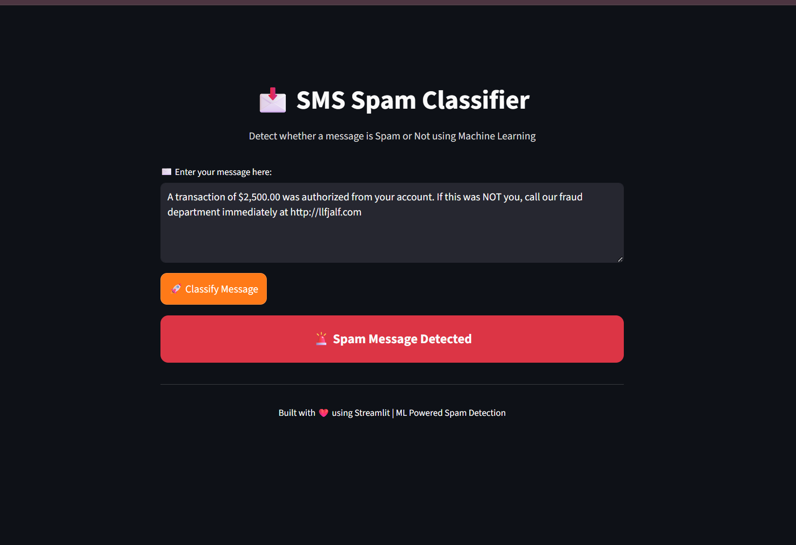
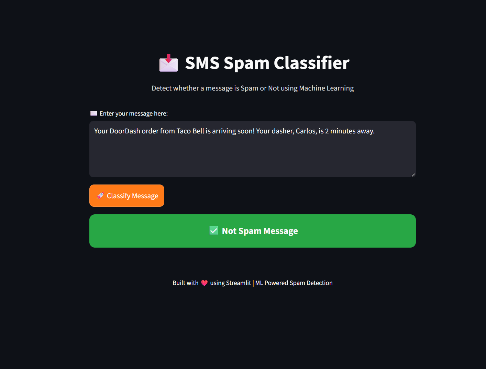

# 📩 SMS Spam Detection System

A Machine Learning-powered web application that classifies SMS messages as **Spam** or **Not Spam** using Natural Language Processing (NLP) techniques and deployed with **Streamlit**.

---

## 🚀 Project Overview

This project focuses on building an intelligent SMS classification system that can automatically detect spam messages with high accuracy and precision.

The workflow includes:

* Data preprocessing & cleaning
* Text transformation using NLP techniques
* Feature extraction using TF-IDF Vectorization
* Training multiple classification models
* Model comparison based on performance metrics
* Hyperparameter tuning for optimization
* Deployment using Streamlit for an interactive UI

---

## ✨ Key Highlights

* 🔍 Implemented multiple Machine Learning algorithms for comparison
* 🏆 Achieved **97% Accuracy** after hyperparameter tuning
* 🎯 Achieved **100% Precision** (No False Positives)
* 📊 Used **Confusion Matrix** to validate model performance
* ⚡ Selected **Multinomial Naive Bayes** as the best-performing model
* 🧠 Applied **TF-IDF Vectorization** for text feature extraction
* 💻 Built a clean and interactive UI using **Streamlit**

---

## 🧠 Machine Learning Approach

### 📌 Text Preprocessing

* Lowercasing
* Tokenization
* Removal of stopwords and punctuation
* Stemming using Porter Stemmer

### 📌 Feature Extraction

* TF-IDF Vectorization to convert text into numerical format

### 📌 Models Used

* Naive Bayes (MultinomialNB) ✅ *Best Performer*
* Logistic Regression
* Support Vector Machine (SVM)
* Decision Tree
* Random Forest

### 📌 Model Evaluation Metrics

* Accuracy
* Precision ⭐ (Primary focus to avoid False Positives)
* Confusion Matrix

---

## 📈 Performance

| Metric         | Score |
| -------------- | ----- |
| Accuracy       | 97%   |
| Precision      | 100%  |
| False Positive | 0     |

> ⚠️ Special focus was given to **Precision** to ensure no legitimate message is marked as spam.

---

## 🔧 Hyperparameter Tuning

* Applied tuning techniques on Multinomial Naive Bayes
* Improved model performance:

  * Accuracy increased from **95% → 97%**
  * Precision improved to **100%**

---

## 📊 Confusion Matrix Insight

* Ensured **zero False Positives**
* Balanced classification between spam and ham messages
* Reliable real-world performance

---

## 🖥️ Tech Stack

* **Programming Language:** Python
* **Libraries:**

  * scikit-learn
  * pandas
  * numpy
  * nltk
* **Visualization:** Matplotlib / Seaborn (Jupyter)
* **Web Framework:** Streamlit
* **Environment:** Jupyter Notebook

---

## 📂 Project Structure

```
├── Datasets/
│   ├── model.pkl
│   ├── vectorizer.pkl
│
├── notebooks/
│   └── model_training.ipynb
│
├── app.py
├── README.md
```

---

## ▶️ How to Run the Project

### 1️⃣ Clone the Repository

```
git clone https://github.com/your-username/sms-spam-classifier.git
cd sms-spam-classifier
```

### 2️⃣ Install Dependencies

```
pip install -r requirements.txt
```

### 3️⃣ Run the Streamlit App

```
streamlit run app.py
```

---

## 📸 UI Preview

* Clean and modern interface
* User-friendly message input
* Instant classification result with visual feedback

---




## 🎯 Future Improvements

* 📊 Add probability/confidence score
* 🌐 Deploy on cloud (Azure / Streamlit Cloud)
* 📱 Mobile-responsive UI
* 💬 Chat-style interface
* 🧠 Deep Learning models (LSTM, BERT)

---

## 🤝 Contributing

Contributions are welcome! Feel free to fork the repository and submit a pull request.

---

## 📬 Contact

If you have any questions or suggestions, feel free to reach out!

---

## ⭐ Acknowledgements

* Dataset inspired from SMS Spam Collection Dataset
* NLP techniques powered by NLTK & Scikit-learn

---

## 🏁 Conclusion

This project demonstrates how Machine Learning and NLP can be effectively used to solve real-world problems like spam detection. With high precision and optimized performance, this model ensures reliable classification with zero false alarms.

---

💡 *Built with passion for Machine Learning & AI*
